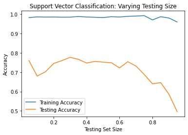

```{r setup, include=FALSE}
knitr::opts_chunk$set(echo = FALSE)
library(tidyverse)
library(lme4) # for glmer model
```

# I. Introduction

With the advancement in technology, the internet has significantly made daily impacts on people. Thanks to the sea of information available online, people can easily get access to various types of businesses, educational services, communicating with others, and just any form of information. This includes customers doing a quick research on the restaurants they want to visit. Hence, many restaurants, cafés, and bakeries promote their food businesses via websites or mobile applications (e.g., Yelp, Tripadvisor, Google Maps) where customers can easily publish reviews and ratings. 

The main objective of websites or mobile applications that are crowd-sourced reviews-based is to not only connect customers to local businesses, but also help these local businesses prosper. According to Bright Local (2021), approximately 77% customers always or regularly read reviews or ratings. Most people are already aware that restaurant ratings are important for reputation; however, a study from Stanford University has suggested that quantity of reviews is as significant since people tend to choose local businesses with more reviews, even though competitors have higher ratings. In general, both online reviews and ratings are vital to local food businesses' growth.

The data analysis in this report aims to support local businesses by investigating the factors that are potentially associated with their ratings and number of reviews. Using the sampled data of restaurants in the United States from Tripadvisor in 2020, we implemented a linear mixed effects model and a negative binomial model to identify the predictors that are correlated with ratings and number of reviews, respectively. Given the results from the two models, the report concludes with recommendations for local businesses. 


# II. Data

## II-i.i. Variables in the Dataset

The original dataset^[Downloaded from Kaggle. See *References*.] from Tripadvisor includes 3,062 restaurants from seven states including California (CA), New York (NY), New Jersey (NJ), Texas (TX), Washington (WA), Oregon (OR), and Pennslyvania (PA). The features of the restaurants in the original dataset include the restaurant name, street address, location, type of restaurant, review rating, number of reviews, comments, contact information, Tripadvisor URL, menu, and price range. 

## II-i.ii. Data Wrangling

```{r read_data}
# Read raw data
tripadvisor_newcol <- read_csv("data/tripadvisor_newcol.csv")
tripadvisor_newcol[rowSums(is.na(tripadvisor_newcol)) > 0,]
tripadvisor_newcol[125,]
```

Before moving forward, we manipulated the original dataset to prepare for the data analysis. First, we used Python to create a new column that classifies whether the comments for each review is negative or positive (denoted as 0 and 1, respectively). We fit Support Vector Classification (SVC) as the Natural Language Processing (NLP) model to a separate dataset that includes basic review sentences and their corresponding denotation of preferences. 



According to the plot that visualizes the simulation of prediction accuracy for each test size, the model yields an optimal prediction accuracy for both the training and testing sets when the testing size is 30% and training size is 70%. Hence, we implemented the SVC model with 70% training size to analyze whether the comments in the Tripadvisor dataset are associated with negativity (0) or positivity (1). Note that the reviews that did not leave any comments were denoted as -1. 

```{r data_wrangling}
# Data Manipulation
## Adding Columns
### city: Extract city name
### state: Extract state name
### review_int: Extract Review rating (First integer before space)
### num_of_reviews: Extract number of reviews (before first space)
### price: Price range (1 is lowest; 3 is highest)
### veg_option: Vegetarian friendly or Vegan option available
### good_bad: 0 if review is negative, 1 if positive, -1 if NA
tripadvisor_new <- tripadvisor_newcol %>% 
  mutate(city = str_extract(Location, "[^,]+"),
         state = str_extract(pattern = "([A-Z]+){2}", string = Location),
         review_int = as.numeric(gsub("\\s.*$", "", Reviews)),
         num_of_reviews = gsub("\\s.*$", "", `No of Reviews`),
         price = case_when(
           Price_Range == "$$ - $$$" ~ 2,
           Price_Range == "$$$$" ~ 3,
           Price_Range == "$" ~ 1,
           TRUE ~ 0
         ),
         veg_option = ifelse(grepl("Vegan|Vegetarian", Type), "Yes", "No"),
         gluten_free = ifelse(grepl("Gluten Free", Type), "Yes", "No"),
         good_bad = ifelse(Comments == "not available", -1, good_bad)) %>% 
  filter(price != 0) %>%      # remove prices that do not make sense
  mutate(num_of_reviews = as.numeric(gsub(",", "", num_of_reviews))) %>% # remove commas to change as numeric
  na.exclude() %>%     # Exclude rows with NA values
  select(-c("...1", "Location", "Reviews", "No of Reviews", "Contact Number",
            "Trip_advisor Url", "Menu", "Price_Range"))
```

Then, using R, we added new variables that included the extracted city and state of each restaurant review from its location. From the variable specifying the type, or category, of each restaurant, we also created two variables indicating whether they are vegetarian friendly and/or have vegan options and whether they have gluten free options. This is because vegan, vegetarian, or gluten free options can be potentially available at all restaurants regardless of their main types of cuisine. If we find in the analysis that vegan, vegetarian, or gluten free options are positively correlated with the number of reviews or ratings, then we can suggest local businesses to add such options for their customers. Lastly, since the number of reviews, review ratings, and price range in the original dataset were inefficiently entered for data analysis, we manipulated the first two as integers and updated the price range as 0 to 3 for readability. 

## II-ii. Exploratory Data Analysis

```{r sentiment_plot}
tripadvisor_new %>% 
  count(good_bad = factor(good_bad)) %>%
  mutate(pct = prop.table(n)) %>% 
  ggplot(aes(x = good_bad, y = pct, fill = good_bad,
             label = scales::percent(pct))) + 
  geom_col() +
  theme_minimal() +
  theme(legend.position = "none") +
  scale_fill_brewer(palette = "Set2") +
  scale_y_continuous(labels = scales::percent) +
  geom_text(position = position_dodge(width = .9), # move to centre of bars
              vjust = 2,    # middle of bar
              size = 6) +
  labs(x = "Comment Sentiment",
       y = "Count Percentage",
       caption = "Figure 2")
```

Based on Support Vector Classification, approximately 66.4% review comments were classified as negative, 13.7% were positive, and the remaining 20% of the reviews did not have any comments in the first place to classify their sentiments. We need to be aware of the fact that 66.4% of the comments are negatively classified since  most of the review ratings fall within the range of 3.0 to 5.0, where 4.5 is the mode that takes up approximately 63.96% of the entire ratings (See Figure 3). This could mean that either the sentiments were wrongly classified with the Support Vector Classification model or people are more generous in leaving ratings in comparison to the detailed comments. 

```{r review_int_plot}
tripadvisor_new %>% count(review_int = as.factor(review_int)) %>% 
  mutate(pct = prop.table(n)) %>% 
  ggplot(aes(x = review_int, y = pct, fill = review_int,
             label = scales::percent(pct))) +
  geom_col() +
  scale_fill_brewer(palette = "Blues") +
  theme_minimal() +
  theme(legend.position = 'none') +
  scale_y_continuous(labels = scales::percent) +
  geom_text(position = position_dodge(width = .9), # move to centre of bars
              vjust = -0.5,    # middle of bar
              size = 3) +
  labs(x = "Rating", y = "Percentage",
       caption = "Figure 3")
```

As shown in Figure 3, ratings for restaurants can only be given in discrete values. However, we will treat this as a numerical continuous variable when fitting it as an outcome to the linear fixed effects model. 


```{r num_of_veg_usa}
tripadvisor_new %>% 
  count(veg_option = factor(veg_option)) %>% 
  mutate(pct = prop.table(n)) %>% 
  ggplot(aes(x = veg_option, y = pct, fill = veg_option, label = scales::percent(pct))) +
  geom_col() +
  theme_minimal() +
  theme(legend.position='none') + # get rid of legend (redundant)
  scale_fill_brewer(palette = "Set1") +
  labs(x = "Vegan or Vegetarian Friendly",
                    y = "Count Percentage",
                    title = "Vegan or Vegetarian Options Available in the USA", 
       caption = "Figure 1") +
  scale_y_continuous(labels = scales::percent) +
  geom_text(position = position_dodge(width = .9), # move to centre of bars
              vjust = 7,    # middle of bar
              size = 7)

tripadvisor_new %>% 
  count(gluten_free = factor(gluten_free)) %>% 
  mutate(pct = prop.table(n)) %>% 
  ggplot(aes(x = gluten_free, y = pct, fill = gluten_free, label = scales::percent(pct))) +
  geom_col() +
  theme_minimal() +
  theme(legend.position='none') + # get rid of legend (redundant)
  scale_fill_brewer(palette = "Set1") +
  labs(x = "Gluten-Free Options",
                    y = "Count Percentage",
                    title = "Gluten-Free Options Available in the USA", 
       caption = "Figure 1") +
  scale_y_continuous(labels = scales::percent) +
  geom_text(position = position_dodge(width = .9), # move to centre of bars
              vjust = 7,    # middle of bar
              size = 7)
```

```{r num_of_restaurants_each_state}
tripadvisor_cleaned %>% 
  group_by(state, veg_option) %>% 
  summarize(n = n()) %>% 
  ggplot(aes(x = reorder(state, -n), y = n, fill = veg_option)) + 
  geom_bar(stat = 'identity') +
  theme_minimal() +
  scale_fill_brewer(name = "Vegan or Vegetarian",
                    palette = "Set1") +
  labs(x = "State", y = "Count", title = "Number of Restaurants in each State",
       caption = "Figure 2")
```

- dominate the world
- life depends on the internet
- so much to explore on the internet
- education, business, shopping, communication
- one of the greatest impacts to humanity

# III. Methodology

```{r model}
mod <- lmer(review_int ~ num_of_reviews + as.factor(price) + 
              veg_option + gluten_free + as.factor(good_bad) +
              (1 | state),
     data = tripadvisor_new)
mod2 <- lm(review_int ~ num_of_reviews + as.factor(price) + veg_option + state,
           data = tripadvisor_cleaned)
summary(mod)
summary(mod2)
sjPlot::tab_model(mod)
```

# IV. Results

# V. Discussion

## V-i. Conclusion

## V-ii. Limitations

- need higher prediction accuracy 

# VI. Reference

https://www.brightlocal.com/research/local-consumer-review-survey/?SSAID=314743&SSCID=81k6_nxmf9

https://blog.consumeraffairs.com/why-the-number-of-reviews-matter/

https://blog.yelp.com/news/restaurant-ratings-on-yelp-are-remarkably-consistent-no-matter-whos-writing-them-when-and-where/

https://www.gloriafood.com/importance-of-online-reviews-for-restaurants

Yelp: "Connecting consumers with great local businesses"
"Protecting businesses"

Questions: Help businesses improve

- Goal: Want to help the system improve
- What features of a restaurant associate to a high rating? Help restaurants
-> Can help the review company predict which restaurants would have a high rating, and have them automatically featured for a wider range of audience
- What are the popular areas?
- 

- 'Vegetarian Friendly', 'Vegan Options'
- Best restaurants
- How price, number of reviews, veg option, and state increases the rating
- Does having vegan/vegetarian options lead to higher rating?


- What features increase the number of restaurant reviews?
-> Helps the app improve user activity


https://www.powerreviews.com/blog/review-volume-conversion-impact/#:~:text=99.9%25%20of%20consumers%20read%20reviews,visit%20pages%20without%20any%20reviews.

https://blog.consumeraffairs.com/why-the-number-of-reviews-matter/


- create categories for seafood, 
# VII. Appendix


```{r highest_rating_table}
# Top 10 Restaurants
tripadvisor_cleaned %>% 
  arrange(desc(review_int), desc(num_of_reviews)) %>% head(n = 10)

# Top 10 Vegan/Vegetarian Restaurants
tripadvisor_cleaned %>% 
  filter(veg_option == "Yes") %>% 
  arrange(desc(review_int), desc(num_of_reviews)) %>% head(n = 10)
```

```{r}
tripadvisor_cleaned %>% 
  ggplot(aes(x = num_of_reviews, fill = veg_option, group = veg_option)) +
  geom_density(alpha = 0.4)
```


https://www.statmethods.net/advstats/glm.html

```{r}
tripadvisor_new %>% 
  ggplot(aes(x = num_of_reviews)) +
  geom_histogram()
tripadvisor_new %>% 
  ggplot(aes(x = review_int)) +
  geom_bar()
```


```{r model}
mod <- lmer(review_int ~ num_of_reviews + as.factor(price) + veg_option +
              (1 | state),
     data = tripadvisor_cleaned)
mod2 <- lm(review_int ~ num_of_reviews + as.factor(price) + veg_option + state,
           data = tripadvisor_cleaned)
summary(mod)
summary(mod2)
sjPlot::tab_model(mod)
```

Predictors: num_of_reviews (discrete, numerical), price (categorical), veg_option (categorical), state (categorical; 8 states - random effect)
Outcome: review_int (discrete, numerical; treat it as categorical)

$$

$$


Partial pooling - Multilevel allows this
Multilevel model has different names: hierarchical model, random effects model, mixed effects model, varying coefficients model
(cf. Complete pooling and no pooling)
intraclass correlation: describes how strongly units in the same group resemble each other.
- ranges from 0 to 1 if all members of groups are identical


Offset should be on number of years open (variable NA)
Check overdispersion


